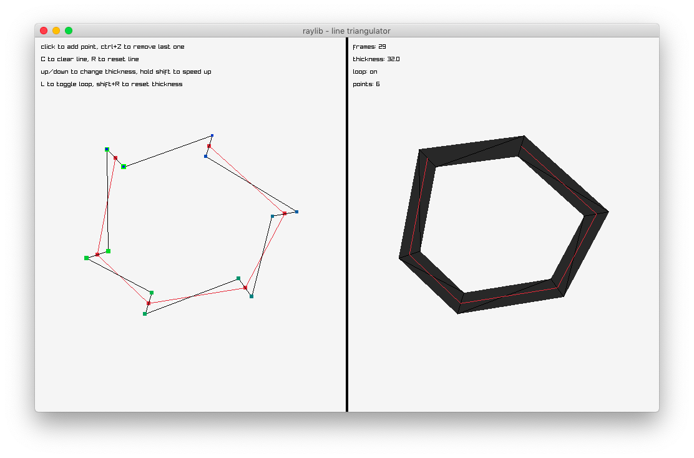

# raylib-line-triangulator

This is an implementation of line triangulation algorithm. It converts a line into a triangle strip of a given thickness and optionally looped (closed).

## build demo

The simplest way to build the demo application is to run `make` in the root directory. It will create a `build` directory, download raylib if it is not installed on your system and compile `demo` there.

## how to use

Inspired by raylib, the usage is pretty simmilar: create a `TriLine` variable, set its parameters and you are ready to go! Oh, and remember to call `UpdateTriLine(TriLine*)` every time you make changes to the struct (including initialization). There is no need to update it on every redraw if the changes are made rarely, especially if your line is static. To draw, use `DrawTriLine(TriLine, Color)`.

## license

The project is licensed under a zlib license – the same as raylib itself.